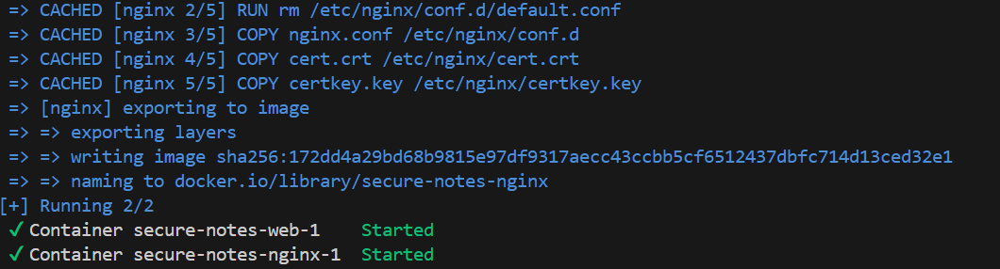
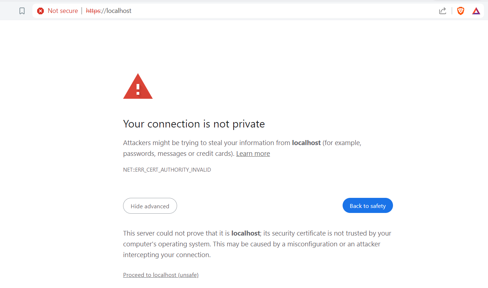
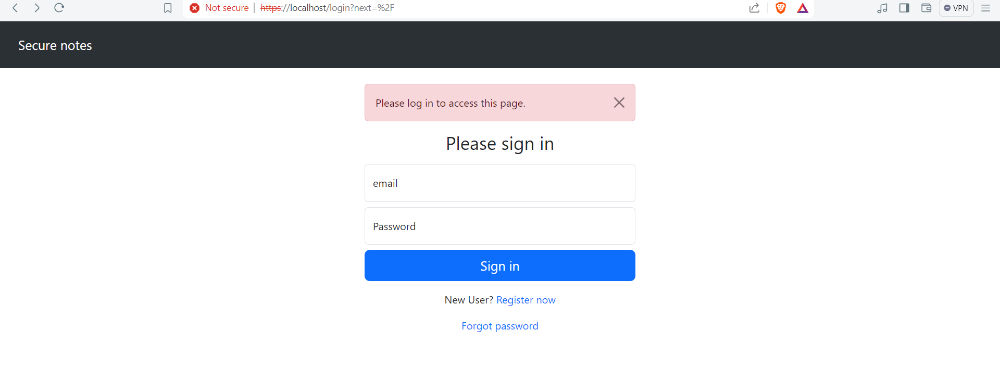
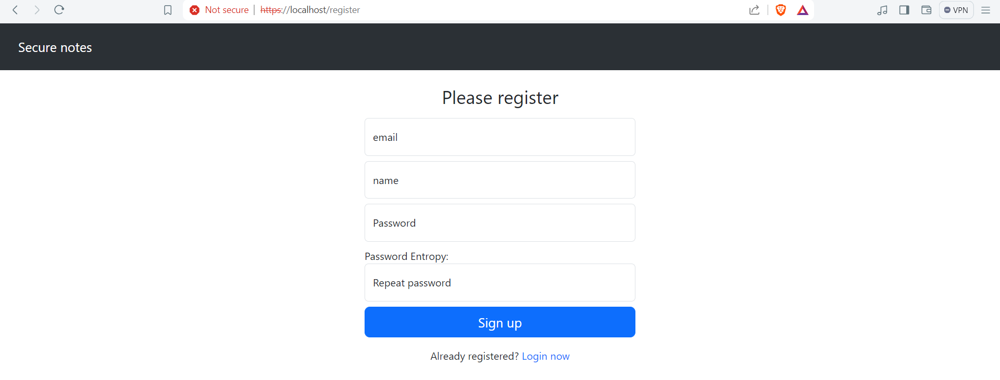

# Secure notes
basic web app to store notes with focus on security practices

# Features
- https is on (ssl self-signed certificate) with nginx http server
- 2FA authentication with Google Authenticator
- database encrypted with Fernet key
- passwords encrypted with additional sha256 encryption algorithm
- prevents common attacks e.g. SQL Injection (using SQLAlchemy) or XSS attack (using bleach)
- random delay time for login
- contenerized app (Docker)

# Future work
- implement 'Forgot password' feature
- restrict user access on public and private notes
- improve hashing data methods e.g. using Bcrypt
- separate database (currently SQLite file db) from source code

# Prerequisites
python, pip (package installer for python) for backend with flask python

It's also recommended to setup virtual environment before running the program for the 1st time.
`python -m venv <name of virtual environment e.g. venv>`

Then activate the venv.

# Requirements
- set up ssl ceritficate and key (self-signed) 
- install dependencies : Go to `app` folder and run:
`pip install -r requirements.txt`

# Usage
Run `./run-docker.sh` to set up and run the containers. This process might take a short while (ensure you have internet connection).

You should see this if successful:

After that, open your browser typing url `https://localhost`

Because of 'self-signed cerificate' this window may appear. Just click 'Advanced' and 'Proceed to localhost(unsafe)' 

In order to turn off the app, run:
`docker-compose down`
